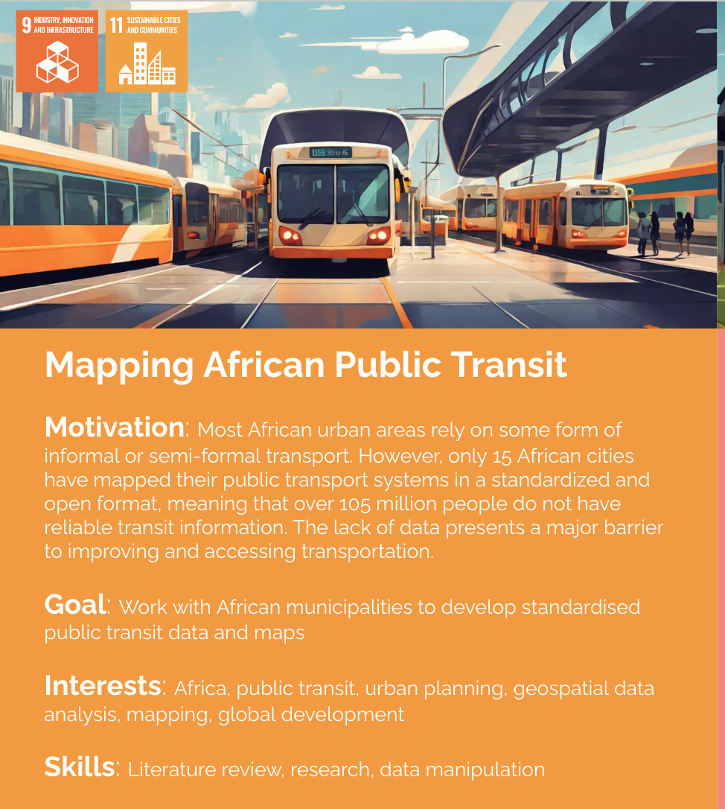

# Mapping African Public Transit

**Motivation**: Most African urban areas rely on some form of informal or semi-formal transport. However, only 15 African cities have mapped their public transport systems in a standardized and open format, meaning that over 105 million people do not have reliable transit information. The lack of data presents a major barrier to improving and accessing transportation.

**Goal**: Work with African municipalities to develop standardised public transit data and maps

**Interests**: Africa, public transit, urban planning, geospatial data analysis, mapping, global development

**Skills**: Literature review, research, data manipulation

### Team Meetings:
[When2Meet](https://www.when2meet.com/?24215131-k65UD)

### Useful Links:

[(PDF) Pathways to integrating paratransit and formal public transport: Case studies from Tshwane, South Africa](https://www.researchgate.net/publication/374210097_Pathways_to_integrating_paratransit_and_formal_public_transport_Case_studies_from_Tshwane_South_Africa)

[10 Mobile Apps to Start Mapping your City’s Transit Network - DigitalTransport4Africa](https://digitaltransport4africa.org/10-mobile-tools-to-start-mapping-your-citys-transit-network/)

[4 Initiatives Working to Map and Improve Informal Transit in Africa | TheCityFix](https://thecityfix.com/blog/4-initiatives-working-to-map-and-improve-informal-transit-in-africa/#:~:text=Today%2C%20only%2015%20African%20cities,information%20on%20their%20transit%20systems.)

[4 Initiatives Working to Map and Improve Informal Transit in Africa | TheCityFix](https://thecityfix.com/blog/4-initiatives-working-to-map-and-improve-informal-transit-in-africa/)

[8 Project locations of the 14 GTFS datasets available in the DT4A data... | Download Scientific Diagram](https://www.researchgate.net/figure/Project-locations-of-the-14-GTFS-datasets-available-in-the-DT4A-data-repository_fig6_372799000)

[Abidjan to Join the Open Data Community with Mapping Project - DigitalTransport4Africa](https://digitaltransport4africa.org/abidjan-to-join-the-open-transit-data-community-with-upcoming-mapping-project/)

[An Analysis of Paratransit Services in African Cities Thanks to Digitaltransport4africa's GTFS Open Data - DigitalTransport4Africa](https://digitaltransport4africa.org/an-analysis-of-paratransit-services-in-african-cities-thanks-to-digitaltransport4africas-gtfs-open-data/)

[An analysis of paratransit services in African cities thanks to GTFS open data - Decisio](https://decisio.nl/en/unanalisi-del-trasporto-pubblico-nelle-citta-africane-grazie-agli-open-data-gtfs/)

[Comparing paratransit in seven major African cities: An accessibility and network analysis - ScienceDirect](https://www.sciencedirect.com/science/article/abs/pii/S0966692321001848)

[Creating a 'Digital Commons' to Harness Data for Africa’s Urban Transport Systems  | TheCityFix](https://thecityfix.com/blog/creating-a-digital-commons-to-harness-data-for-africas-urban-transport-systems/)

[Data Transport : We Improve African Mobility through transit Data.](https://data-transport.org/)

[Data Transport: We Improve African Mobility Through transit Data](https://data-transport.org/?lang=en)

[DIGITAL MATATUS](http://digitalmatatus.com/)

[Digital Transport for Africa · GitLab](https://gitlab.com/digitaltransport)

[Digital Transport for Africa | World Resources Institute](https://www.wri.org/initiatives/digital-transport-africa)

[Digitalization in Kumasi, Alexandria, Maputo Shows How to Integrate Africa’s Complex Paratransit Networks - DigitalTransport4Africa](https://digitaltransport4africa.org/digitalization-in-kumasi-alexandria-maputo-shows-how-to-integrate-africas-complex-paratransit-networks/)

[Digitalization in Kumasi, Alexandria, Maputo Shows How to Integrate Africa’s Complex Paratransit Networks | TheCityFix](https://thecityfix.com/blog/digitalization-in-kumasi-alexandria-maputo-shows-how-to-integrate-africas-complex-paratransit-networks/)

[DigitalTransport4Africa](https://digitaltransport4africa.org/)

[DT4A Innovation Challenge Updates: Testimonials from Cities - DigitalTransport4Africa](https://digitaltransport4africa.org/dt4a-innovation-challenge-updates-testimonials-from-cities/)

[dt4a\_event\_presentation](https://www.ssatp.org/sites/ssatp/files/document/04_KhartouMap_Presentation.pdf)

[Export | OpenStreetMap](https://www.openstreetmap.org/export#map=12/6.4961/3.3385)

[Flex - General Transit Feed Specification](https://gtfs.org/extensions/flex/)

[From Minibuses to 'Boda Bodas,' Informal Transport Systems Could Be an Untapped Climate Change Solution | TheCityFix](https://thecityfix.com/blog/from-minibuses-to-boda-bodas-informal-transport-systems-could-be-an-untapped-climate-change-solution/)

[Full article: Mapping minibuses in Maputo and Nairobi: engaging paratransit in transportation planning in African cities](https://www.tandfonline.com/doi/full/10.1080/01441647.2019.1598513)

[General Transit Feed Specification](https://gtfs.org/)

[GTFS For ParaTransit System? - Communauté de la Fabrique des Mobilités](https://wiki.lafabriquedesmobilites.fr/wiki/GTFS_For_ParaTransit_System%3F)

[GTFS-flex - TransitWiki](https://www.transitwiki.org/TransitWiki/index.php/GTFS-flex)

[GTFS: Kinshasa - Dataset - TUMI Datahub](https://hub.tumidata.org/dataset/gtfs-kinshasa)

[GTFS: Stellenbosch - Dataset - TUMI Datahub](https://hub.tumidata.org/dataset/gtfs-stellenbosch)

[How Are New Informal Transit Routes Formed? | TheCityFix](https://thecityfix.com/blog/how-are-new-informal-transit-routes-formed/)

[How data experts track informal transport | Apolitical](https://apolitical.co/solution-articles/en/mapping-data-experts-help-cities-informal-transport)

[How Higher Quality Data Can Help Improve Urban Planning and Reduce Inequities | TheCityFix](https://thecityfix.com/blog/how-higher-quality-data-can-help-improve-urban-planning-and-reduce-inequities/)

[In African Cities, Mapping Paratransit Makes for Smarter Mobility | TheCityFix](https://thecityfix.com/blog/african-cities-mapping-paratransit-makes-smarter-mobility-travis-fried-iman-abubaker/)

[KhartouMap Report : simplebooklet.com](https://simplebooklet.com/khartoumap#page=7)

[Link repository for international GTFS training materials · WorldBank-Transport/GTFS-Training-Materials Wiki](https://github.com/WorldBank-Transport/GTFS-Training-Materials/wiki/Link-repository-for-international-GTFS-training-materials)

[Mapped: Africa's Transport System - Vivid Maps](https://vividmaps.com/transport-system-in-africa/)

[Mapping and representing informal transport: state of the art - Safari Njema](https://www.safari-njema.polimi.it/mapping-informal-transit/)

[Mapping minibuses in Maputo and Nairobi: engaging paratransit in transportation planning in African](https://discovery.ucl.ac.uk/id/eprint/10123186/1/01441647.2019.pdf)

[Mapping the informal public transport network in Kampala with smartphones : making sense of an organically evolved chaotic system in an emerging city in Sub-Saharan Africa](https://repository.up.ac.za/handle/2263/57973)

[MobilityData/mobility-database-catalogs: The Catalogs of Sources of the Mobility Database.](https://github.com/MobilityData/mobility-database-catalogs?tab=readme-ov-file)

[Modernization and Inclusion? Informal and Semiformal Transport in Latin America | TheCityFix](https://thecityfix.com/blog/modernization-and-inclusion-informal-and-semiformal-transport-in-latin-america/)

[Open Data for Inclusive Urban Public Transport Globally - Digital Paper Transport 4 Africa | MobiliseYourCity](https://www.mobiliseyourcity.net/open-data-inclusive-urban-public-transport-globally-digital-paper-transport-4-africa)

[Presentation/Lubumbashi Paratransit - TRB Conference - Jan 2018.pdf · master · Digital Transport for Africa / Data / Africa / Lubumbashi · GitLab](https://gitlab.com/digitaltransport/data/africa/lubumbashi/-/blob/master/Presentation/Lubumbashi%20Paratransit%20-%20TRB%20Conference%20-%20Jan%202018.pdf?ref_type=heads)

[Projects - DigitalTransport4Africa](https://digitaltransport4africa.org/projects/)

[Public Transport Challenges in Africa: Mapping and Transit Data as a Remedy - SLOCAT](https://slocat.net/public-transport-challenges-in-africa-mapping-and-transit-data-as-a-remedy/)

[Public Transportation in Africa: A Roadmap To A Fuller Understanding - Transport Africa](https://www.transportafrica.org/understanding-public-transportation-in-africa/)

[The Power of Data - More Equitable Transport Systems in Africa - Urbanet](https://www.urbanet.info/data-transport-systems-africa-equitable/)

[Updated GTFS-Flex: What is it and How is it used? - N-CATT](https://n-catt.org/guidebooks/updated-gtfs-flex/#:~:text=GTFS%2DFlex%20is%20an%20emerging,(e.g.%2C%20Google%20Maps).)

[Who Plans Transit in African Cities? Ask the Bus Drivers. - DigitalTransport4Africa](https://digitaltransport4africa.org/who-plans-transit-in-african-cities-ask-the-bus-drivers/)

[Why do paratransit operators resist participation in bus rapid transit? Case evidence from Bogota, Mexico City, Johannesburg and Lagos: Transport Reviews: Vol 41, No 1](https://www.tandfonline.com/doi/full/10.1080/01441647.2020.1818872?src=recsys)

[WRI-Cities/static-GTFS-manager: GUI interface for creating, editing, exporting of static GTFS data for a public transit authority](https://github.com/WRI-Cities/static-GTFS-manager)

[WRI-TfC-DT4A\_Alex\_FinalReport\_V2-1.pdf](https://transportforcairo.com/wp-content/uploads/2023/09/WRI-TfC-DT4A_Alex_FinalReport_V2-1.pdf)
